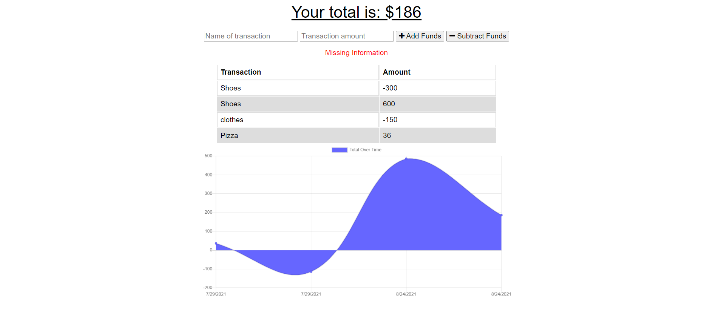

# Offline Budget Tracker

## Description

This application provides the user a dynamic budget tracker that visualizes the data upon entry. The data is stored so that the application may be used offline.

## Visuals

See image below for budget tracker platform:

## Links

Please find the deployed application here: https://offline-budget-tracker-ss.herokuapp.com/
